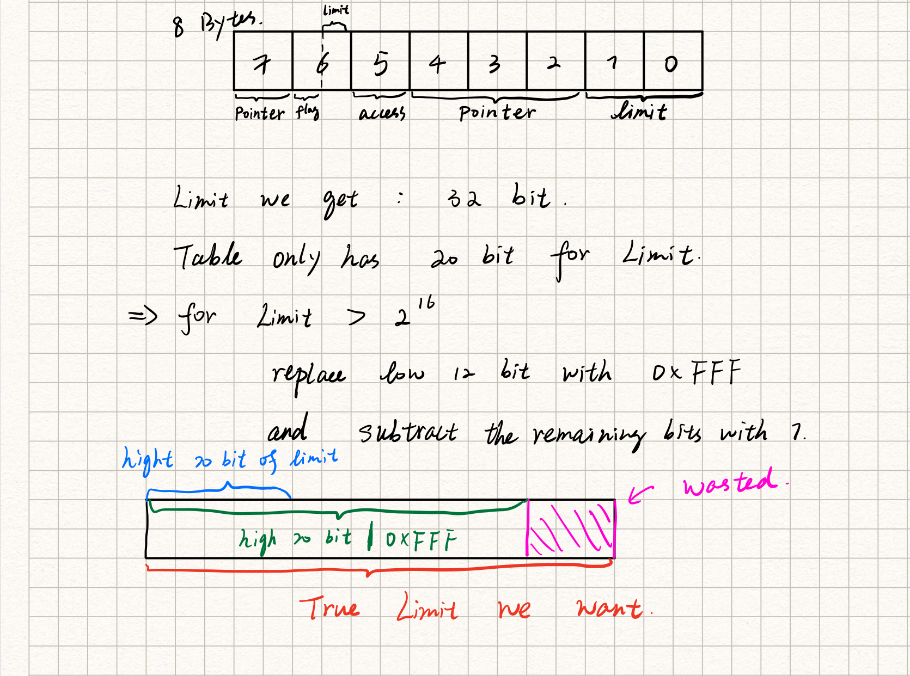
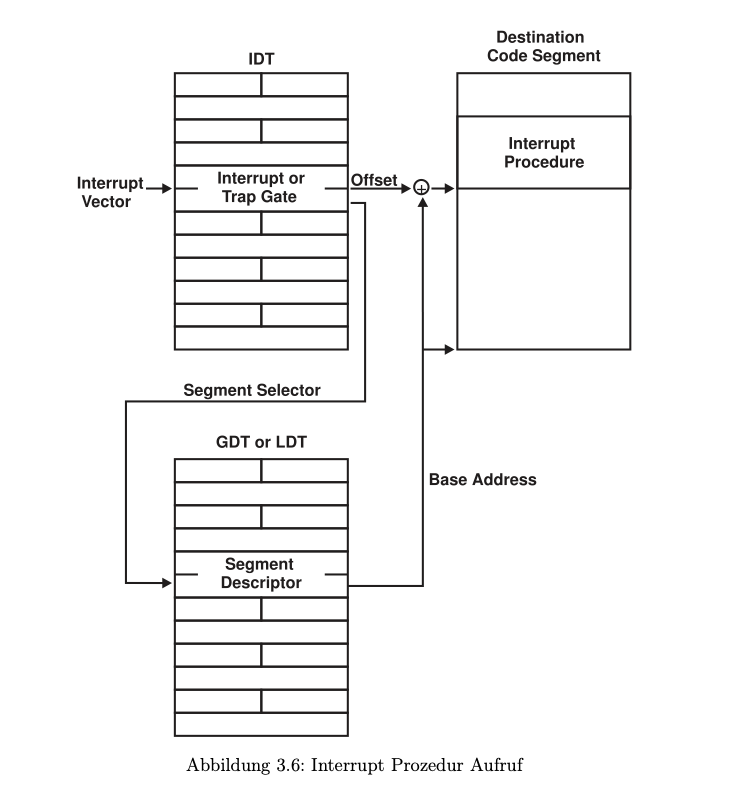
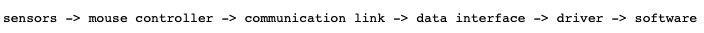
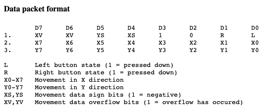
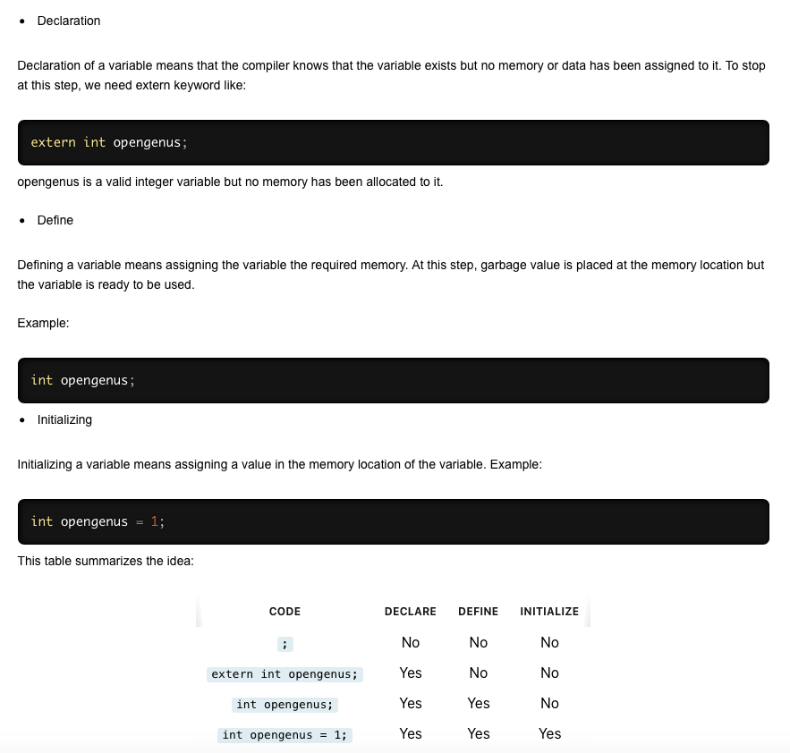

# myos

[](https://github.com/RichardLitt/standard-readme)
TODO: Put more badges here.

build a operating system by myself

TODO: Fill out this long description.

## Table of Contents

- [Background](#background)
- [ProblemCollection](#ProblemCollection)
- [ToolTricks](#ToolTricks)
- [Contributing](#contributing)
- [License](#license)

## Background

### Global Descriptor Table

xxxxx(When interrup occurs, some code should be executed. But the current process has no knowledge about the target adress. The GDT stores the target adress of every interrupt.)xxxxx 

The sentence above is totally wrong!! It's the Description of IDT.
GDT stores the Segment base address and limitation! For example, there's a Segment for Data, and a Segment for Code, when we want to execute a programm, we first go GDT and find the base address of the code segment and then add the offset up, then we get the function address.



### Interrupt Descriptor Table



So basiclly, When an interrupt occurs, the CPU will take the address loaded in idtr(register) and find the coresponding handler of this interrupt in IDT, but in our case, since we have to store all the state of currently runing process, we can't directly go to the handler, but need to go interruptstus.s first. But then there is a problem, after we go into the interruptstus.s, we don't know the portnumber anymore, but we still need the portnumber to get the right handler. So we do it in stupid way: one handler for one interrupt.
```
.macro HandleInterruptRequest num
.global _ZN16InterruptManager26HandleInterruptRequest\num\()Ev
_ZN16InterruptManager26HandleInterruptRequest\num\()Ev:
    movb $\num + IRQ_BASE, (interruptnumber)
    jmp int_bottom
.endm

HandleInterruptRequest 0x00
HandleInterruptRequest 0x01
...

```


## ProblemCollection

- ***"asm volatile" and lgdt***
```
    asm volatile("lgdt (%0)": :"p" (((uint8_t *) i)+2));
```

LGDT: Loads the values in the source operand into the global descriptor table register (GDTR) or the interrupt descriptor table register (IDTR). The source operand specifies a 6-byte memory location that contains the base address (a linear address) and the limit (size of table in bytes) of the global descriptor table (GDT) or the interrupt descriptor table (IDT). If operand-size attribute is 32 bits, a 16-bit limit (lower 2 bytes of the 6-byte data operand) and a 32-bit base address (upper 4 bytes of the data operand) are loaded into the register. If the operand-size attribute is 16 bits, a 16-bit limit (lower 2 bytes) and a 24-bit base address (third, fourth, and fifth byte) are loaded. Here, the high-order byte of the operand is not used and the high-order byte of the base address in the GDTR or IDTR is filled with zeros.

Consider the following function

```
int main(int argc, const char * argv[]) {
    // insert code here...

    unsigned int i[2];
    i[0] = 0x41424344;
    i[1] = 0x45464748;

    cout<<((unsigned char *)i+2)<<endl;
    return 0;
}
```

- ***Communicate with Pic***
```
InterruptManager::InterruptManager(...)
{
    ...
    
    picMasterCommand.Write(0x11);
    picSlaveCommand.Write(0x11);

    picMasterData.Write(0x20);
    picSlaveData.Write(0x28);

    picMasterData.Write(0x04);
    picSlaveData.Write(0x02);

    picMasterData.Write(0x01);
    picSlaveData.Write(0x01);

    picMasterData.Write(0x00);
    picSlaveData.Write(0x00);
    
    ...
}
```

I think the function of this code is to initialize the PIC and tell the PIC not to ignore the interrupt signal but send them to the CPU, but i am not sure coz this problem is too hardware. 

- ***Data packets of Mouse***





Picture captured from:https://courses.cs.washington.edu/courses/cse477/00sp/projectwebs/groupb/PS2-mouse/mouse.html

As shown in the figure above, When the mouse is moved or pressed, it will send a 3-byte packet to mouse driver. And that explains the code following that confused me for a while:

```
MouseDriver::HandleInterrupt(...)
{
    ...
    buffer[offset] = dataport.Read();
    offset = (offset + 1) % 3;

    if(offset == 0)
    {
        ...
    }
    ...
}
```

It means when a mouse interrupt occurs, the processor will land in MouseDriver.Handler function, but since the packet is 3-byte, the driver has to read data from the port 3 times bevor it starts to handle this interrupt. 

There is still one problem remain unsolved: In my opinion, an Interrupt signal can only forces the cpu to step into the Mouse Handle function once, which is absolutely wrong from the sight of the code(an Interrupt corresponds to 3 times function call), so maybe a mouse event will result in 3 interrupt impuls? 

- ***extern keyword***

First of all, in a C/C++ programm, **function is valid everywhere!!**. e.g., a function **void f1();** is defined in main.c, it can also be used in file.c as long as they are linked together. Recall that functions are labels in assembly, which also explained this.

What about variables?

- ***difference between "" and ''***
Double quotes is for string and single quotes for character. I have met an interesting bug because of this difference.

```
 52         void OnKeyDown(char c)                                              
 53         {
 54             char* foo = " ";
 55             foo[0] = c;
 56             printf(foo);
 57         }
```

in the code above, i wrongly wrote **foo = "";**, and after that everytime i pressed a keyboard, it will print **key+Hello World**, because the end descriptor of a string '\0' is replaced by character c and thus printf won't stop reading memory. But what surprised me is that, right behind the character, is the memory for "Hello World" that used in **kernelMain**, i think it's stored in Stack, but ***will it not be deleted?***

- ***Virtual Keyworad***
Rules for Virtual Functions

1. Virtual functions cannot be static and also cannot be a friend function of another class.
2. Virtual functions should be **accessed using pointer or reference** of base class type to achieve run time polymorphism.
3. The **prototype of virtual functions should be same** in base as well as derived class.
4. They are always defined in base class and overridden in derived class. It is not mandatory for derived class to override (or re-define the virtual function),     in that case base class version of function is used.
5. A class may have virtual destructor but it cannot have a virtual constructor.

e.g.:

```
// CPP program to illustrate 
// concept of Virtual Functions 
  
#include <iostream> 
using namespace std; 
  
class base { 
public: 
    virtual void print() 
    { 
        cout << "print base class" << endl; 
    } 
  
    void show() 
    { 
        cout << "show base class" << endl; 
    } 
}; 
  
class derived : public base { 
public: 
    void print() 
    { 
        cout << "print derived class" << endl; 
    } 
  
    void show() 
    { 
        cout << "show derived class" << endl; 
    } 
}; 
  
int main() 
{ 
    base* bptr; 
    derived d; 
    bptr = &d; 
  
    // virtual function, binded at runtime 
    bptr->print(); 
  
    // Non-virtual function, binded at compile time 
    bptr->show(); 
} 
```

Output:
```
print derived class
show base class
```
- ***ifndef-define-endif***
https://en.wikipedia.org/wiki/Include_guard

Those are called #include guards.
Once the header is included, it checks if a unique value (in this case HEADERFILE_H) is defined. Then if it's not defined, it defines it and continues to the rest of the page.
When the code is included again, the first ifndef fails, resulting in a blank file.
That prevents double declaration of any identifiers such as types, enums and static variables.

- ***include "" Vs. include <> ***
In practice, the difference is in the location where the preprocessor searches for the included file.

For include <filename> the preprocessor searches in an implementation dependent manner, normally in search directories pre-designated by the compiler/IDE. This method is normally used to include standard library header files.

For #include "filename" the preprocessor searches first in the same directory as the file containing the directive, and then follows the search path used for the #include <filename> form. This method is normally used to include programmer-defined header files.
    


## ToolTricks

- ***tricks of git***
1. to delete multiple files in repository

```git rm -r folder_name```

```git commit -m "Remove duplicated directory"```

```git push origin master```

- ***tricks of vim***

## Contributing

PRs accepted.

Small note: If editing the README, please conform to the [standard-readme](https://github.com/RichardLitt/standard-readme) specification.

## License

? © 2021 ZirongCai
