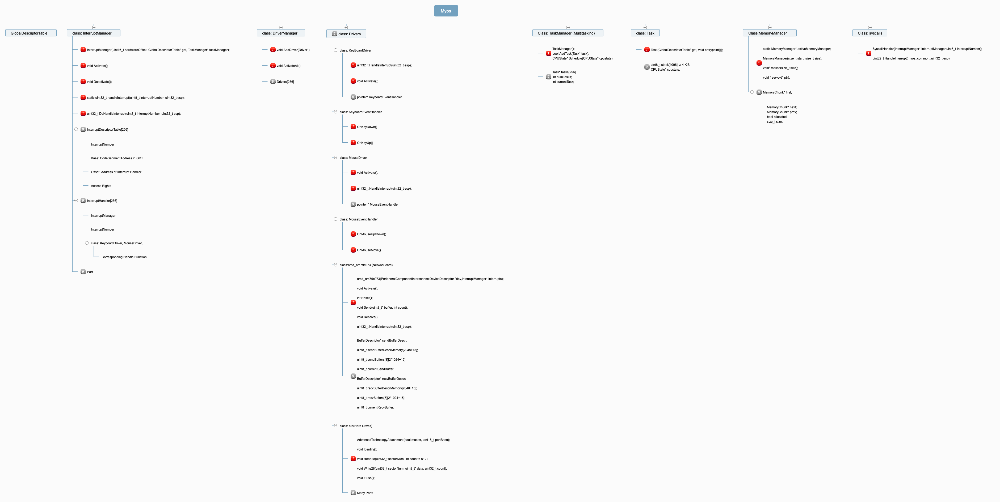
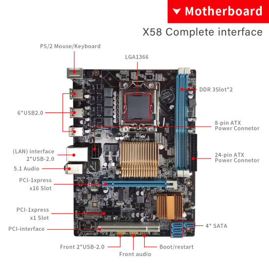
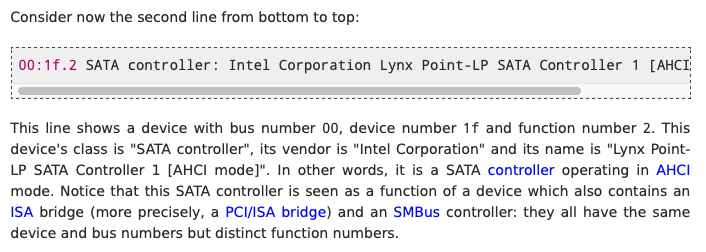
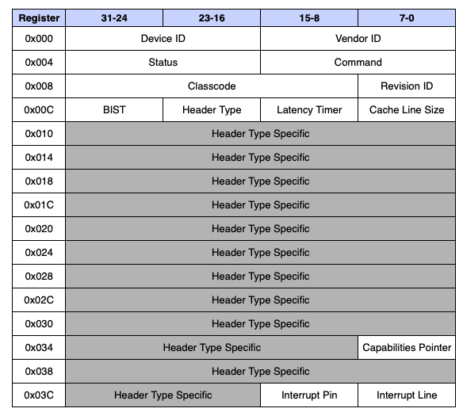
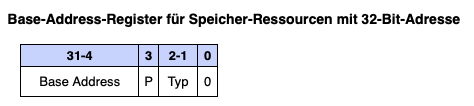
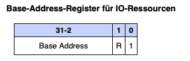
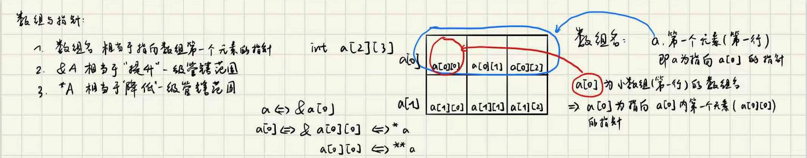

# myos

[](https://github.com/RichardLitt/standard-readme)
TODO: Put more badges here.

  build a operating system by myself

  TODO: Fill out this long description.

## Table of Contents

- [Background](#background)
- [ProblemCollection](#ProblemCollection)
- [ToolTricks](#ToolTricks)
- [Contributing](#contributing)
- [License](#license)

## Background

### Constructure

1 for public functions.(aka, API)

9 for private functions/parameters.



### Global Descriptor Table

  xxxxx(When interrup occurs, some code should be executed. But the current process has no knowledge about the target adress. The GDT stores the target adress of every interrupt.)xxxxx 

  The sentence above is totally wrong!! It's the Description of IDT.
GDT stores the Segment base address and limitation! For example, there's a Segment for Data, and a Segment for Code, when we want to execute a programm, we first go GDT and find the base address of the code segment and then add the offset up, then we get the function address.


### Interrupt Descriptor Table


  So basiclly, When an interrupt occurs, the CPU will take the address loaded in idtr(register) and find the coresponding handler of this interrupt in IDT, but in our case, since we have to store all the state of currently runing process, we can't directly go to the handler, but need to go interruptstus.s first. But then there is a problem, after we go into the interruptstus.s, we don't know the portnumber anymore, but we still need the portnumber to get the right handler. So we do it in stupid way: one handler for one interrupt.
```
.macro HandleInterruptRequest num
.global _ZN16InterruptManager26HandleInterruptRequest\num\()Ev
_ZN16InterruptManager26HandleInterruptRequest\num\()Ev:
    movb $\num + IRQ_BASE, (interruptnumber)
    jmp int_bottom
.endm

HandleInterruptRequest 0x00
HandleInterruptRequest 0x01
...

```

### Programmable Interrupt Comtroller (PIC)

  In short, we don't want CPU to waste time on check the status of all port. So PIC is invented. When a Hardware has some data that need to be processed, then it will send a corresponding IRQ number to PIC, and in PIC we can programm for each IRQ, which interruptnumber in IDT it should refer to. 
（例： 键盘的A键被摁了，则键盘会产生一个interrupt signal 带着对应的IRQ Number去pic,然后pic进行判定这个IRQ的优先度，需要被处理的话就把会到这个IRQ对应的interruptnumber给CPU，CPU去IDT里找对应的Interrupt处理函数。）


  more details see : 

   http://www.lowlevel.eu/wiki/PIC_Tutorial

   http://www.lowlevel.eu/wiki/Programmable_Interrupt_Controller#Initialisierung

### Peripheral Component Interconnect(PCI)

   http://www.lowlevel.eu/wiki/Peripheral_Component_Interconnect

   https://diego.assencio.com/?index=649b7a71b35fc7ad41e03b6d0e825f07

   https://en.wikipedia.org/wiki/PCI_configuration_space



  We can see from the picture that Devices like Keyboard/Mouse has a fixed Port. But unlike Keyboard and Mouse, there are some Devices that not every computer has. For example, Network Card, Sound Card and so on. But the operating system should allow the user to decide which devices they want to install in their Computer and no matter which device is used, the OS can still recognize it and use the right driver for this device. And that is PCI. From the picture we can see that PCI is just a port, but what is inserted in this port is decided by the user. So how does the OS recognize the device that is inserted?



  There are totally 8 Buses for PCI, and for each bus, it allows 32 Devices, for each Devices, there can be 8 functions. So everytime when the computer is booted, The OS will iterate for all 8*32*8 functions and ask if there is any function here. Note that all devices are forced to at least have a function. For each function, there is an individual **configuration space**. 



  Every PCI device has a set of registers called the device's configuration space which, among other things, display the **device ID (DID)**, the **vendor ID (VID)** and the **device class** to the operational system. The constructure of configure space is showed in the picture above. These are just numeric codes which the operational system maps into human-readable names through a predefined table. Vendor IDs are assigned by a group of companies called the PCI Special Interest Group and device IDs are assigned by their respective vendors. With vendor ID, device id and device class, the OS is now capable to load a correspoding driver for this device. Up to here, automatic configuration is almost done. What remains is, how to communicate with PCI devices?

  Configuration reads and writes can be initiated from the CPU in two ways: one legacy method via I/O addresses 0xCF8 and 0xCFC, and another called memory-mapped configuration.

A **Base Address Register(BAR)**: is used to:



- Memory mapping mode(a set of main memory is reserved by the device, and whenever the device want to send data to cpu or vice versa, it just write the data in this memory space)

   1. specify how much memory a device wants to be mapped into main memory, and

   2. after device enumeration, it holds the (base) address, where the mapped memory block begins.



- I/O mode(a command port and a data port. If the cpu want to get the data of a device, it first write the Bus/Device/Function information and the offset of wanted register into the command port, and then it will get the information in data port)

   1. specify the port number.

### Multitasking

  Multitasking means a processor can prosess multiple task at same time. It **does not** mean that the processor can execute multiple code at same time, but that after prosesses task1, the processor can go back to the instruction of task2, where the processor was last time it leaves task2. For example, the processor is executing some code of safari, but at the next time interrupt, it may go back to wechet to check whether there is a new message or not, but the user can not be aware of. It's not hard to achieve this. We just reserve some space in ram for every task and store all the registers information in that space when the processor leaves this task.

  Note that everytime when the processor want to switch to other task, it will automatically push some registers in stack, such as eip(instruction pointer)...
But other registers like eax,ebx will not be stored. So we need to do it manually.


### Dynamic Memory Management

  We have already two types of variable: 1. Static Variable, whose lifetime (or "extent") is the entire run of the program ( Static Storage ), 2. Local Variable, a local variable is a variable that is given local scope( Stack ). But now, as a programmer, we want to define a variable that neither will be deleted outside the scope it's declared, nor exist til the end of the programm, but deleted whenever we want to. And that is why dynamic memory management is invented. A dynamic Variable will be allocated in Heap. 
  
### Network Card

### Hard Drives

### System Calls

In computing, a system call (commonly abbreviated to syscall) is the programmatic way in which a computer program requests a service from the kernel of the operating system on which it is executed. This may include hardware-related services (for example, accessing a hard disk drive), creation and execution of new processes, and communication with integral kernel services such as process scheduling. System calls provide an essential interface between a process and the operating system.

But why a program can't use the system resources? I mean, it's just some code like **asm("outb %0, %1" : : ...)**. The answer is here : https://www.zhihu.com/question/355721858(i only found chinese answer :( ). At the beginning, there is no such kernel space and user space. As time goes, more and more PCs should be able to access multiple tasks and should be able to used by different users. And thus, the CPU manufacturer has invented a new CPU which has two different model, namely kernel model and user model. The OS is running on kernel model which has more Authority. All program is running on user kernel which almost has no Authority to the hardwares. Thus, the operating system should offer an API to programs such that they can access the hardware resources like file read/write. And that API is called system calls!


## ProblemCollection

- ***"asm volatile" and lgdt***(solved)
```
    asm volatile("lgdt (%0)": :"p" (((uint8_t *) i)+2));
```

  LGDT: Loads the values in the source operand into the global descriptor table register (GDTR) or the interrupt descriptor table register (IDTR). The source operand specifies a 6-byte memory location that contains the base address (a linear address) and the limit (size of table in bytes) of the global descriptor table (GDT) or the interrupt descriptor table (IDT). If operand-size attribute is 32 bits, a 16-bit limit (lower 2 bytes of the 6-byte data operand) and a 32-bit base address (upper 4 bytes of the data operand) are loaded into the register. If the operand-size attribute is 16 bits, a 16-bit limit (lower 2 bytes) and a 24-bit base address (third, fourth, and fifth byte) are loaded. Here, the high-order byte of the operand is not used and the high-order byte of the base address in the GDTR or IDTR is filled with zeros.

  Consider the following function

```
int main(int argc, const char * argv[]) {
    // insert code here...

    unsigned int i[2];
    i[0] = 0x41424344;
    i[1] = 0x45464748;

    cout<<((unsigned char *)i+2)<<endl;
    return 0;
}
```

- ***Communicate with Pic***(solved)
```
InterruptManager::InterruptManager(...)
{
    ...
    
    picMasterCommand.Write(0x11);
    picSlaveCommand.Write(0x11);

    picMasterData.Write(0x20);
    picSlaveData.Write(0x28);

    picMasterData.Write(0x04);
    picSlaveData.Write(0x02);

    picMasterData.Write(0x01);
    picSlaveData.Write(0x01);

    picMasterData.Write(0x00);
    picSlaveData.Write(0x00);
    
    ...
}
```

  I think the function of this code is to initialize the PIC and tell the PIC not to ignore the interrupt signal but send them to the CPU, but i am not sure coz this problem is too hardware. (solved. see PIC)


- ***Data packets of Mouse***(solved)


  Picture captured from:https://courses.cs.washington.edu/courses/cse477/00sp/projectwebs/groupb/PS2-mouse/mouse.html

  As shown in the figure above, When the mouse is moved or pressed, it will send a 3-byte packet to mouse driver. And that explains the code following that confused me for a while:

```
MouseDriver::HandleInterrupt(...)
{
    ...
    buffer[offset] = dataport.Read();
    offset = (offset + 1) % 3;

    if(offset == 0)
    {
        ...
    }
    ...
}
```

  It means when a mouse interrupt occurs, the processor will land in MouseDriver.Handler function, but since the packet is 3-byte, the driver has to read data from the port 3 times bevor it starts to handle this interrupt. 

  There is still one problem remain unsolved: In my opinion, an Interrupt signal can only forces the cpu to step into the Mouse Handle function once, which is absolutely wrong from the sight of the code(an Interrupt corresponds to 3 times function call), so maybe a mouse event will result in 3 interrupt impuls? 

- ***extern keyword***(solved)

  First of all, in a C/C++ programm, **function is valid everywhere!!**. e.g., a function **void f1();** is defined in main.c, it can also be used in file.c as long as they are linked together. Recall that functions are labels in assembly, which also explained this.

  What about variables?

- ***difference between "" and ''***(solved)
  Double quotes is for string and single quotes for character. I have met an interesting bug because of this difference.

```
 52         void OnKeyDown(char c)                                              
 53         {
 54             char* foo = " ";
 55             foo[0] = c;
 56             printf(foo);
 57         }
```

  in the code above, i wrongly wrote **foo = "";**, and after that everytime i pressed a keyboard, it will print **key+Hello World**, because the end descriptor of a string '\0' is replaced by character c and thus printf won't stop reading memory. But what surprised me is that, right behind the character, is the memory for "Hello World" that used in **kernelMain**, i think it's stored in Stack, but ***will it not be deleted?***

- ***Virtual Keyworad***(solved)
  Rules for Virtual Functions

   1. Virtual functions cannot be static and also cannot be a friend function of another class.
   2. Virtual functions should be **accessed using pointer or reference** of base class type to achieve run time polymorphism.
   3. The **prototype of virtual functions should be same** in base as well as derived class.
   4. They are always defined in base class and overridden in derived class. It is not mandatory for derived class to override (or re-define the virtual function),     in that case base class version of function is used.
   5. A class may have virtual destructor but it cannot have a virtual constructor.

  e.g.:

```
// CPP program to illustrate 
// concept of Virtual Functions 
  
#include <iostream> 
using namespace std; 
  
class base { 
public: 
    virtual void print() 
    { 
        cout << "print base class" << endl; 
    } 
  
    void show() 
    { 
        cout << "show base class" << endl; 
    } 
}; 
  
class derived : public base { 
public: 
    void print() 
    { 
        cout << "print derived class" << endl; 
    } 
  
    void show() 
    { 
        cout << "show derived class" << endl; 
    } 
}; 
  
int main() 
{ 
    base* bptr; 
    derived d; 
    bptr = &d; 
  
    // virtual function, binded at runtime 
    bptr->print(); 
  
    // Non-virtual function, binded at compile time 
    bptr->show(); 
} 
```


```
Output:print derived class
show base class
```
- ***ifndef-define-endif***(solved)
  https://en.wikipedia.org/wiki/Include_guard

  Those are called #include guards.
  
  Once the header is included, it checks if a unique value (in this case HEADERFILE_H) is defined. Then if it's not defined, it defines it and continues to the rest of the page.
  
  When the code is included again, the first ifndef fails, resulting in a blank file.
  
  That prevents double declaration of any identifiers such as types, enums and static variables.

- ***include "" Vs. include <> *** (solved)

  In practice, the difference is in the location where the preprocessor searches for the included file.

  For #include <> the preprocessor searches in an implementation dependent manner, normally in search directories pre-designated by the compiler/IDE. This method is normally used to include standard library header files.

  For #include "" the preprocessor searches first in the same directory as the file containing the directive, and then follows the search path used for the #include <filename> form. This method is normally used to include programmer-defined header files.
    
  Note: We use **-Iinclude** option in g++ so it will search the files in /include directory.

- ***.extern and .global in aseembly***(unsolved)

  The 'extern' directive tells the assembler that a particular label won't be found in the current source file and that is must be declared as a 'global' elsewhere. It's the job of the linker to resolve the connection between the reference to the extern label and its global declaration.

  The 'global' directive indicates that a label can be shared by files other than the one in which it's defined. (Without the 'global' directive, a label can only be used within the file in which it's been defined.)

  One big advantage to explicitly identifying global's and extern's is that you can use the same names for labels in multiple source modules and not have them interfere with each other. You also gain control of access to variables and subroutines from outside of the source file to minimize side effects between different modules.

  Question: In a C programm, if i define a function f1() in main.c, i can use it in other files like file1.c without using keyword global and extern, **because the compiler will link this two file together and so f1() is valid for all file in this programm, right?** But since we also link the interruptstus.s and kernel.cpp together, why muss we extern the Interrupthandler function in interruptstus.s ???

- ***pci***(unsolved)

```
void PeripheralComponentInterconnectController::SelectDrivers(DriverManager* driverManager, InterruptManager* interrupts)
{
    for(int bus = 0; bus < 8; bus++)
    {
        for(int device = 0;device < 32; device++)
        {
             for(int function = 0; function < numFunctions; function++)
            {
                PeripheralComponentInterconnectDeviceDescriptor dev = GetDeviceDescriptor(bus, device, function);

                for(int barNum = 0; barNum < 6; barNum++)//for every functions there's 6 bar???
                {
                    BaseAddressRegister bar = GetBaseAddressRegister(bus, device, function, barNum);
                    if(bar.address && (bar.type == InputOutput))
                    
                        /* If there are multiple base address in the configuration space, what should be the portBase of this device? */
                        dev.portBase = (uint32_t)bar.address;
                }
            }
        }
    }
    ...
}
```

- ***Scope***

  Variables defined in { }, is only valid in this area.

```
int main(void) {
  char x = 'm';
  printf("%c\n", x);
  {
    printf("%c\n", x);
    char x = 'b';
    printf("%c\n", x);
  }
  printf("%c\n", x);
}
```

``` Output: m m b m```

- ***static keyword***

  https://www.geeksforgeeks.org/static-keyword-cpp/

  Static keyword has different meanings when used with different types. We can use static keyword with:

   Static Variables : Variables in a function, Variables in a class

   Static Members of Class : Class objects and Functions in a class
   
- ***new vs. mallloc***
  
  https://www.cnblogs.com/qg-whz/p/5140930.html
  
  https://www.cnblogs.com/QG-whz/p/5060894.html

```
 Feature                  | new/delete                     | malloc/free                   
--------------------------+--------------------------------+-------------------------------
 Memory allocated from    | 'Free Store'                   | 'Heap'                        
 Returns                  | Fully typed pointer            | void*                         
 On failure               | Throws (never returns NULL)    | Returns NULL                  
 Required size            | Calculated by compiler         | Must be specified in bytes    
 Handling arrays          | Has an explicit version        | Requires manual calculations  
 Reallocating             | Not handled intuitively        | Simple (no copy constructor)  
 Call of reverse          | Implementation defined         | No                            
 Low memory cases         | Can add a new memory allocator | Not handled by user code      
 Overridable              | Yes                            | No                            
 Use of (con-)/destructor | Yes                            | No                            
```


- ***try and catch***

  https://www.cnblogs.com/QG-whz/p/5136883.html
  
- ***array***



## ToolTricks

- ***tricks of git***

Book:http://git-scm.com/book/en/v2

  1. to delete multiple files in repository

```git rm -r folder_name```

```git commit -m "Remove duplicated directory"```

```git push origin master```

  2. pull force

    https://www.freecodecamp.org/news/git-pull-force-how-to-overwrite-local-changes-with-git/
    
  3. Undo  Revert commit

    https://sethrobertson.github.io/GitFixUm/fixup.html#uncommitted_everything
    
    https://stackoverflow.com/questions/4114095/how-do-i-revert-a-git-repository-to-a-previous-commit

- ***tricks of vim***

  1. Replace and Substitue

    https://vim.fandom.com/wiki/Search_and_replace
    
  2. automatic alignment

    ```gg=G```


- ***tricks of make***

  https://www.gnu.org/software/make/manual/make.html#Variables-Simplify

  https://swcarpentry.github.io/make-novice/reference.html


## Contributing

PRs accepted.

Small note: If editing the README, please conform to the [standard-readme](https://github.com/RichardLitt/standard-readme) specification.


## License

? © 2021 ZirongCai
